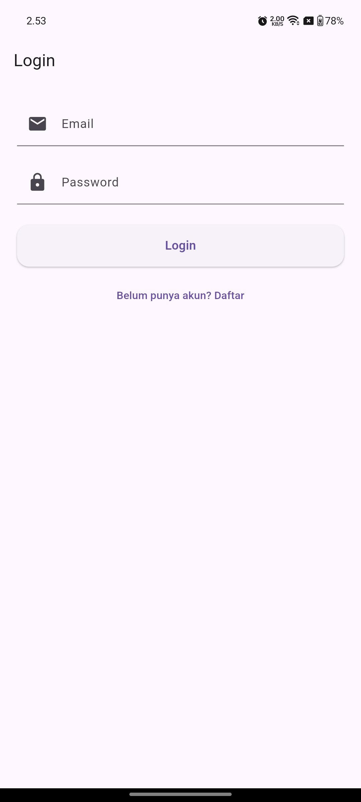
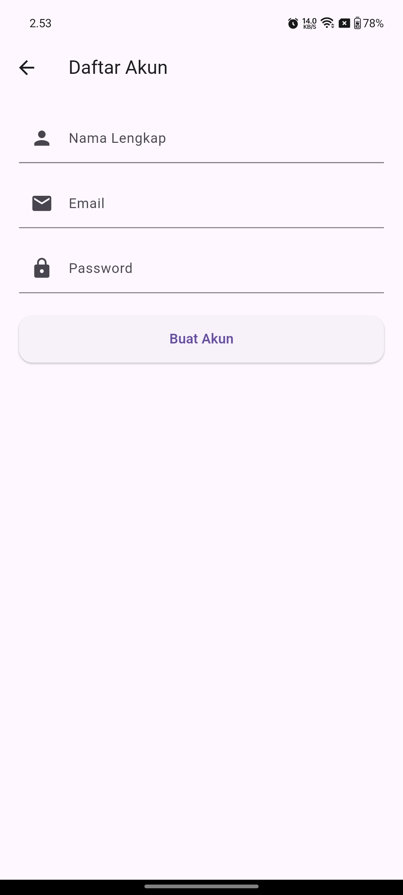
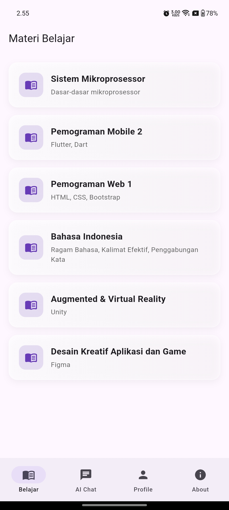
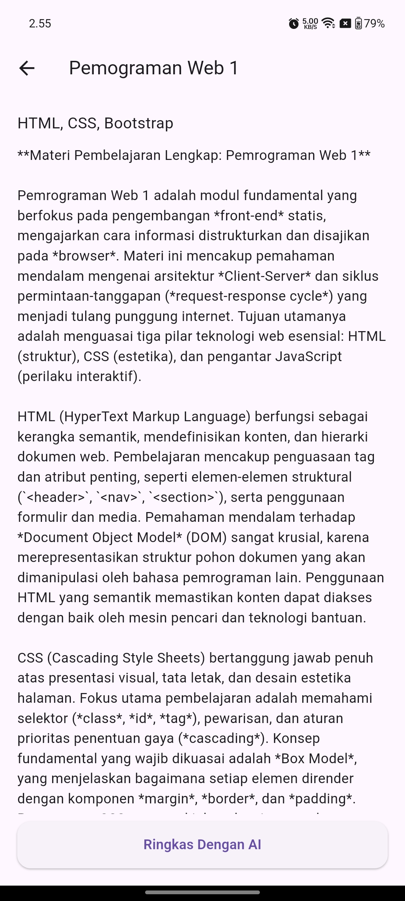
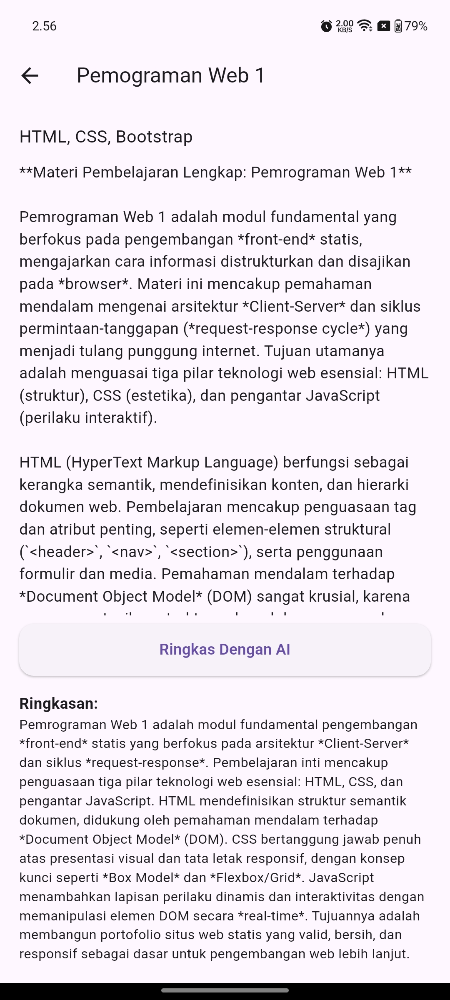
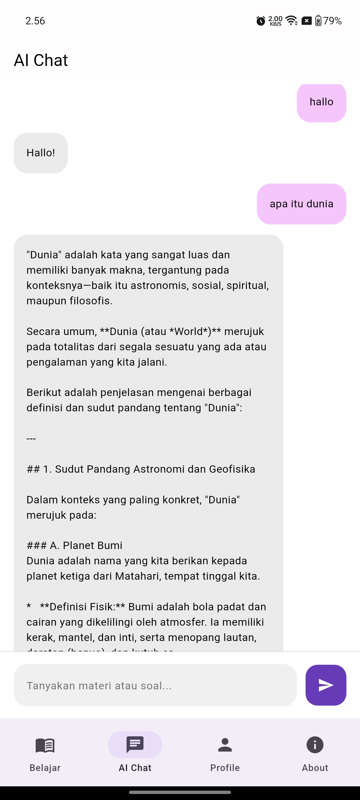
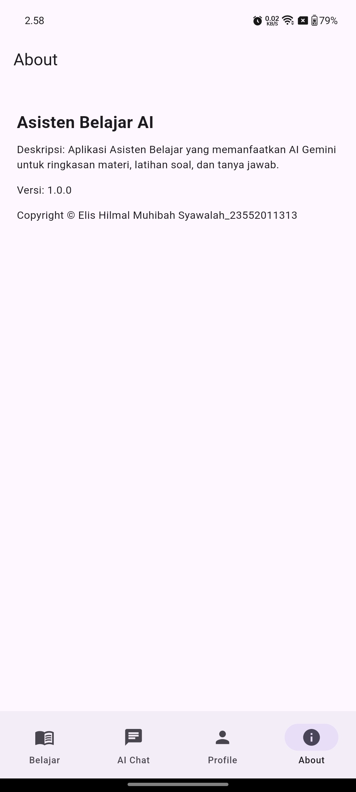

## Data Diri
Nama : Elis Hilmal Muhibah Syawalah 
Nim : 23552011313 
Kelas : TIF RP 23 CID B 

# 🎓 Asisten Belajar AI – Aplikasi Pembelajaran Cerdas Berbasis Flutter

Asisten Belajar AI adalah aplikasi mobile untuk membantu mahasiswa memahami materi kuliah melalui ringkasan, penjelasan, dan tanya jawab dengan Google Gemini AI.
Aplikasi ini dibuat sebagai bagian dari UTS Pemrograman Mobile 2.

---
## SplashScreen
- SplashScreen menampilkan logo dan judul aplikasi sebelum masuk ke halaman login.

## ✨ Fitur Utama

### Login
- User harus login sebelum masuk aplikasi
- Jika belum punya akun, wajib melakukan registrasi
- Data login disimpan menggunakan SQLite

### Register
- Jika user tidak mempunyai akun maka di haruskan register untuk membuat akun
- User membuat akun baru dengan email & password

### 🏠 Beranda
- Menampilkan daftar materi pembelajaran
- Navigasi ke halaman: Materi Belajar, Tanya AI, Profile, About

### 📘 Materi Belajar
- Grid List materi belajar
- Setiap materi dapat dibuka untuk melihat penjelasan dan ringkasan AI

### 🤖 Tanya AI (Gemini)
- User dapat bertanya tentang penjelasan materi, contoh soal, dan jawaban/langkah pengerjaan
- Powered by *Google Gemini API*

### 👤 Profile
- Menampilkan nama & email user
- Mengedit Profile
- Tombol Logout

### ℹ About Page
- Informasi Aplikasi
- CopyRight

-----------||--------------------------------------------||---------------------||---------------
## 📸 Screenshot Aplikasi

### Login Page 

 
### Reguster Page 

 

### Beranda  

 

### Materi  
  
  

### Tanya AI  
  

### Profile  
  
  
  

### About
  
